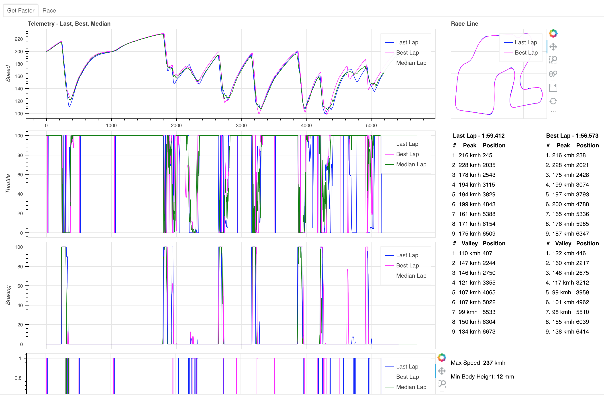
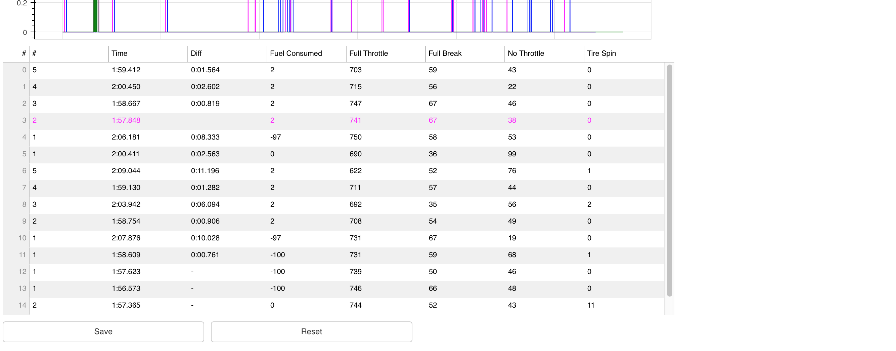

# gt7dashboard

gt7dashboard is a live dashboard for Gran Turismo 7. Based on the recent discovery of the telemetry interface of GT7 described [here first](https://www.gtplanet.net/forum/threads/gt7-is-compatible-with-motion-rig.410728 ). This began as a fork of Bornhalls [gt7telemetry](https://github.com/Bornhall/gt7telemetry).

## Features



...



* Speed/Distance Graph for Last Lap, Best Lap and Median Lap.
  * Median Lap is calculated by the median of all recent laps
* Throttle/Distance Graph
* Braking/Distance Graph
* Coasting/Distance Graph
* Race Line Graph
* Table of Speed Peaks and Valleys. Compared between best and last lap
* Additional data for tuning such as Max Speed and Min Body Height
* List off all recent laps with additional metrics, measured in percentage * 1000 for better visiuals
* Ability to Save current laps and reset all laps
* Additional "Race view" with only the laps

## How to run

1. `pip3 -r requirements.txt` to install Python dependencies (once)
2. `GT7_PLAYSTATION_IP=<CONSOLE IP ADDRESS> bokeh serve gt7dashboard.py`

## Docker

There is a `Dockerfile` available. This is a sample `docker-compose` configuration:

```yaml
    gt7dashboard:
        build:
            context: /home/user/work/gt7dashboard
        restart: unless-stopped
        container_name: gt7dashboard
        user: "1002"
        ports:
            - "5006:5006/tcp"
            - "33740:33740/udp"
        volumes:
            - /home/user/gt7data/:/usr/src/app/data
        environment:
            - BOKEH_ALLOW_WS_ORIGIN=domain_of_server:5006
            - GT7_PLAYSTATION_IP=<playstation ip>
            - TZ=Europe/Berlin
```


## Get Telemetry of a Demonstration lap or Replay

Replays and demonstrations will also output telemetry data. Start the replay or demonstration and enjoy the data.

Some demonstration data is cut short at the start. In the game this comes as a fast-forward effect at the start of the lap. Start the demonstration again, to get a proper lap.
