# gt7dashboard

gt7dashboard is a live dashboard for Gran Turismo 7. Based on the recent discovery of the telemetry interface of GT7 described [here first](https://www.gtplanet.net/forum/threads/gt7-is-compatible-with-motion-rig.410728 ). This began as a fork of Bornhalls [gt7telemetry](https://github.com/Bornhall/gt7telemetry).

See the [Manual](#manual) for detailed instructions.

## Features

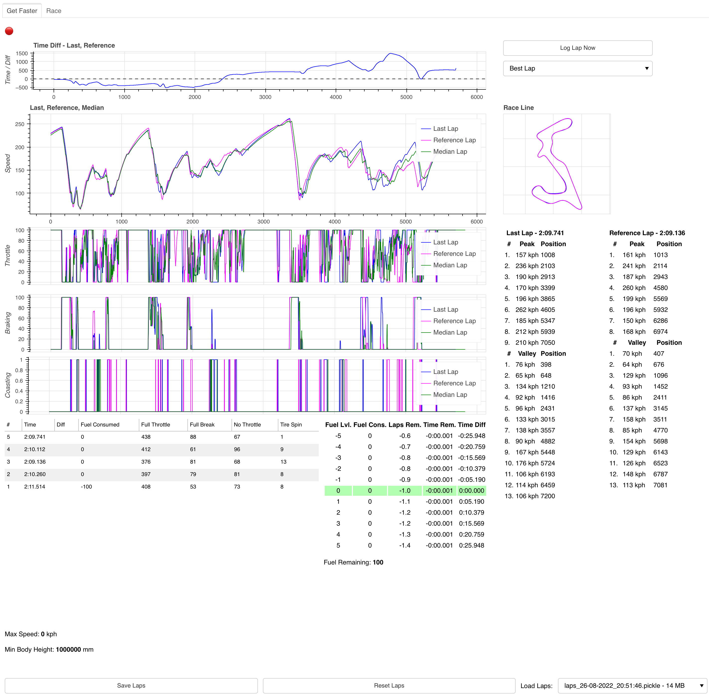
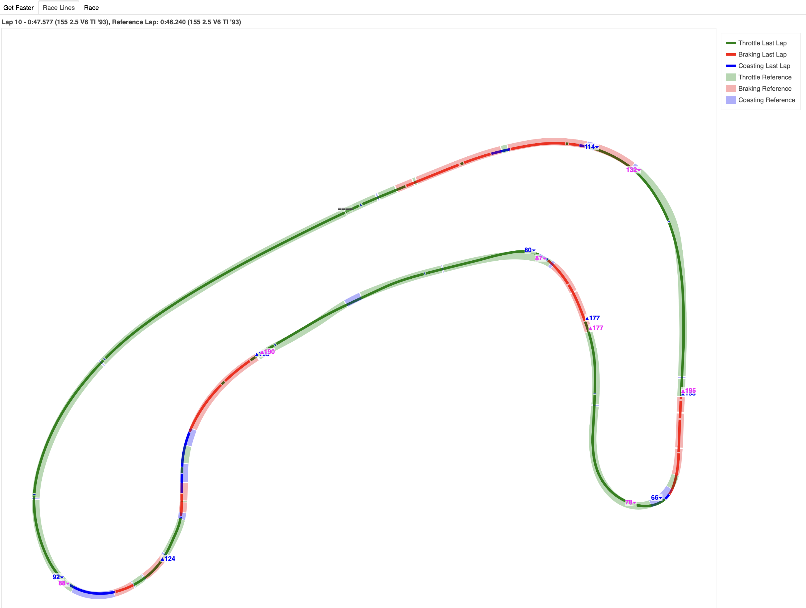

* Time Diff Graph between Last Lap and Reference Lap
  * *Under dashed line* is better and *over dashed line* is worse than Reference Lap
* Race Line view with speed peaks and valleys of last lap and reference lap
* Speed/Distance Graph for Last Lap, Reference Lap and Median Lap
  * Median Lap is calculated by the median of all recent laps
* Speed Variance Graph showing speed deviation in your best laps
* Picker for Reference Lap
  * Default is Best Lap
* Throttle/Distance Graph
* Braking/Distance Graph
* Coasting/Distance Graph
* Race Line Graph
* Table of Speed Peaks and Valleys. Compared between reference and last lap
* Relative Fuel Map for choosing the right Fuel Map setting in order to reach distance, remaining time and desired lap times
* List off all recent laps with additional metrics, measured in percentage * 1000 for better readability
* Additional data for tuning such as Max Speed and Min Body Height
* Ability to Save current laps and reset all laps
* Race Lines for the most recent laps depicting throttling (green), braking (red) and coasting (blue)
* Additional "Race view" with only fuel map
* Optional Brake Points (slow) when setting `GT7_ADD_BRAKEPOINTS=true`
* Add additional laps from the race lap table to the diagrams

### Get Telemetry of a Demonstration lap or Replay

Enable the "Always Record" checkbox to always record replays. Otherwise will only the laps you are actually driving are recorded.

## How to run

You will have to have a running Python installation. Look [here](https://wiki.python.org/moin/BeginnersGuide/Download) for instructions.

* If you are on Windows edit the file `run.bat` and replace `<...>` with your IP address. Run the file with a double click afterwards.

* If you are on MacOS edit the file `run.command` and replace `<...>` with your IP address. Run the file with a double click afterwards.

* If you are on Linux edit the file `run.sh` and replace `<...>` with your IP address. Run the file with a double click afterwards.

The commands `pip3` or `python3` may be different on your OS. Try `pip` or `python` instead.

## How to run for experienced users

1. (Once) `pip3 install -r requirements.txt` to install Python dependencies
2. (Optional) Download the list of car names with `python3 helper/download_cars_csv.py`. Without this file, car names will only show as `CAR-ID-123`.
3. Running the Dashboard
   - (Mac/Linux) `GT7_PLAYSTATION_IP=<CONSOLE IP ADDRESS> bokeh serve .` (when inside the  `gt7dashboard` folder)
   - (Windows) `set GT7_PLAYSTATION_IP=<CONSOLE IP ADDRESS>` and `python -m bokeh serve .`  (when inside the `gt7dashboard` folder)

## Troubleshooting

If you run into `TimeoutError`s make sure to check your firewall. You may have to enable UDP connections on port 33740 or 33739.

## Docker

There is a `Dockerfile` available. Run it like this:

```bash
docker build -t gt7dashboard /home/user/work/gt7dashboard

docker run -d --restart unless-stopped \
  --name gt7dashboard \
  --user 1002 \
  -p 5006:5006/tcp \
  -p 33740:33740/udp \
  -v /home/user/gt7data/:/usr/src/app/data \
  -e BOKEH_ALLOW_WS_ORIGIN=domain_of_server:5006 \
  -e GT7_PLAYSTATION_IP=<playstation ip> \
  -e TZ=Europe/Berlin \
  gt7dashboard
```

This is a sample `docker-compose` configuration:

```yaml
    gt7dashboard:
        build:
            context: /home/user/work/gt7dashboard
        restart: unless-stopped
        container_name: gt7dashboard
        user: "1002"
        ports:
            - "5006:5006/tcp"
            - "33740:33740/udp"
        volumes:
            - /home/user/gt7data/:/usr/src/app/data
        environment:
            - BOKEH_ALLOW_WS_ORIGIN=domain_of_server:5006
            - GT7_PLAYSTATION_IP=<playstation ip>
            - TZ=Europe/Berlin
```
## Contributing

Please add unit tests for all new features, calculations etc.

If you want to add something to the manual, please edit `gt7dashboard/gt7help.py` and use `make doc` to generate the `README.md`.

## Manual

### Tab 'Get Faster'

#### Header

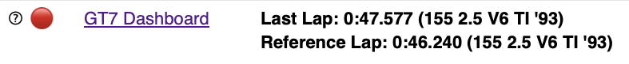

The red or green button reflects the current connection status to Gran Turismo 7. i.e. if there was a packet received successfully in the last second, the button will turn green.

Next is a brief description of the last and reference lap. The reference lap can be selected on the right side.

#### Lap Controls

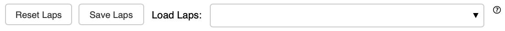

You can reset all laps with the 'Reset Laps' button. This is helpful if you are switching tracks or cars in a session. Otherwise the different tracks will mix in the dashboard.
'Save Laps' will save your recorded laps to a file. You can load the laps afterwards with the dropdown list to the right.

#### Time / Diff

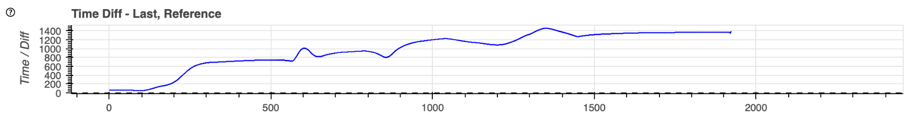

 This is a graph for showing the relative time difference between the last lap and the reference lap.
Everything under the solid bar at 0 is slower than the reference lap. Everything above is slower than the reference lap.

If you see a bump in this graph to the top or the bottom this means that you were slower or faster at this point respectively.


#### Manual Controls

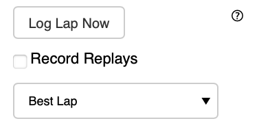

'Log Lap Now' will log a lap now even you have not crossed the finished line. This is helpful for missions or license tests where the end of a test is not necessarily identical with the finish line.

The checkbox 'Record Replays' will allow you to record replays. Be careful since also background action before and after a time trial is counted as a replay. This is when a car drives on the track in the background of the menu.

In the 'Best Lap' dropdown list you can select the reference lap. Usually this will point to the best lap of the session.


#### Speed 

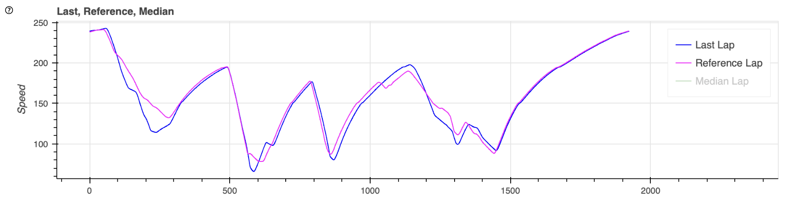

The total speed of the laps selected. This value is in km/h. or mph. depending on your in-game setting

#### Race Line

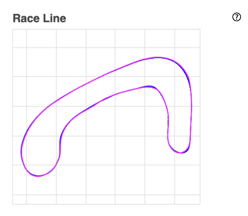

This is a race line map with the last lap (blue) and the reference lap (magenta). Zoom in for more details.

This map is helpful if you are using the index number of a graph to quickly determine where in the lap a measurement was taken.

See the tab 'Race Line' for a more detailed race line.

#### Speed Deviation (Spd. Dev.)

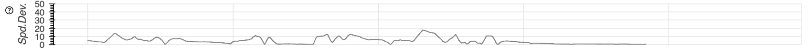

Displays the speed deviation of the fastest laps within a 5.0% time difference threshold of the fastest lap.
Replay laps are ignored. The speed deviation is calculated as the standard deviation between these fastest laps.

With a perfect driver in an ideal world, this line would be flat. In a real world situation, you will get an almost flat line, 
with bumps at the corners and long straights. This is where even your best laps deviate.

You may get some insights for improvement on your consistency if you look at the points of the track where this line is bumpy.

The list on the right hand side shows your best laps that are token into consideration for the speed variance.


I got inspired for this diagram by the [Your Data Driven Podcast](https://www.yourdatadriven.com/).
On two different episodes of this podcast both [Peter Krause](https://www.yourdatadriven.com/ep12-go-faster-now-with-motorsports-data-analytics-guru-peter-krause/) and [Ross Bentley](https://www.yourdatadriven.com/ep3-tips-for-racing-faster-with-ross-bentley/) mentioned this visualization.
If they had one graph it would be the deviation in the (best) laps of the same driver, to improve said drivers performance learning from the differences in already good laps. If they could do it once, they could do it every time.

#### Throttle

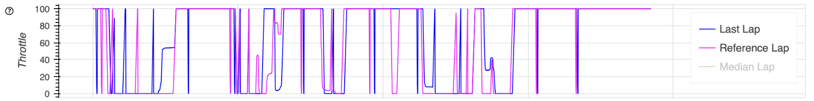

This is the amount of throttle pressure from 0% to 100% of the laps selected.

#### Braking

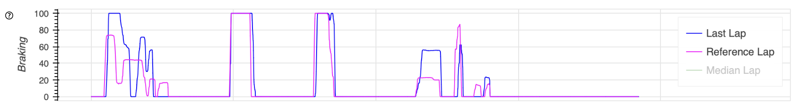

This is the amount of braking pressure from 0% to 100% of the laps selected.

#### Coasting

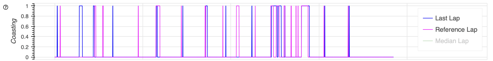

This is the amount of coasting from 0% to 100% of the laps selected. Coasting is when neither throttle nor brake are engaged.

#### Gear

This is the current gear of the laps selected.

#### RPM

This is the current RPM of the laps selected.

#### Tire Speed / Car Speed

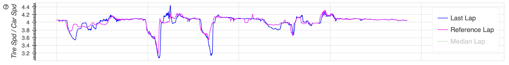

This is the relation between the speed of the tires and the speed of the car. If your tires are faster than your car, your tires might be spinning. If they are slower, your tires might be blocking. Use this judge your car control.

#### Time Table

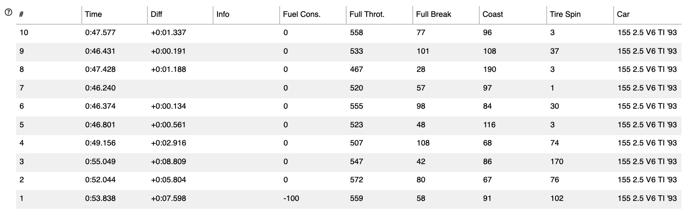

A table with logged information of the session. # is the number of the lap as reported by the game. There might be multiple laps of the same number if you restarted a session. Time and Diff are self-explaining. Info will hold additional meta data, for example if this lap was a replay.
Fuel Consumed is the amount of fuel consumed in the lap.

What follows know are simple metrics for the characteristics of the lap. This is counted as ticks, which means instances when the game reported a state. For example Full Throttle = 500 means that you were on full throttle during 500 instances when the game sent its telemetry.
The same goes for Full Break, Coast and Tire Spin. Use this to easily compare your laps.

You can click on one of these laps to add them to the diagrams above. These laps will be deleted if you reset the view or reload the page.

Car will hold the car name. You will have to have the `db/cars.csv` file downloaded for this to work.


#### Fuel Map

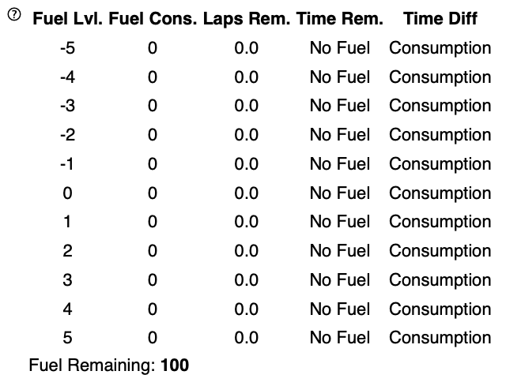

This fuel map will help to determine the fuel setting of your car. The game does not report the current fuel setting, so this map is relative.
The current fuel setting will always be at 0. If you want to change the fuel to a leaner setting count downwards with the amount of steps left. For example: If you are at fuel setting 2 in the game and want to go to the games fuel setting 5, have a look at Fuel Lvl. 3 in this map.
It will give you a raw assumption of the laps and time remaining and the assumed time difference in lap time for the new setting.

#### Tuning Info

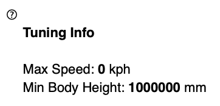

Here is some useful information you may use for tuning. Such as Max Speed and minimal body height in relation to the track. The later seems to be helpful when determining the possible body height.

### Tab 'Race Line'


This is a race line map with the last lap (blue) and the reference lap (magenta). This diagram does also feature spead peaks (▴) and valleys (▾) as well as throttle, brake and coasting zones.

The thinner line of the two is your last lap. The reference line is the thicker translucent line. If you want to make out differences in the race line have a look at the middle of the reference lap line and your line. You may zoom in to spot the differences and read the values on peaks and valleys.


