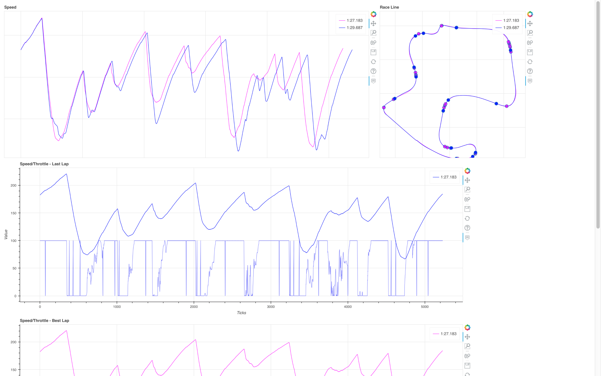

# Fork of gt7telemetry

This is my fork of gt7telemetry of Bornhall

It adds the following things:

1. Write lap times and metrics to a file (`race.log`)

2. Log additional metrics and lap times to the back of the console window

   1. This mode can be set exclusively if you set the environment variable `GT7_LIMITED=true`

3. Plot car telemetries with speed/throttle graphs, a race track map and more. A browser window opens automatically after each lap. The diagram will always feature the best lap and the latest lap. The best lap is the best lap of the session. If you want to record a different best lap or a different track, restart `gt7telemetry.py`.

   

## Get Telemetry of a Demonstration lap or Replay

Replays and demonstrations will also output telemetry data. Start the replay or demonstration and enjoy the data.

Some demonstration data is cut short at the start. In the game this comes as a fast-forward effect at the start of the lap. Start the demonstration again, to get a proper lap.
